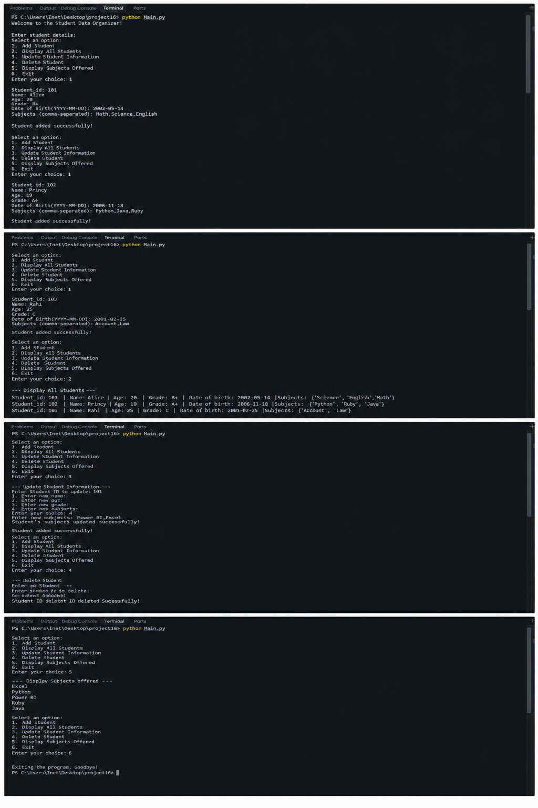

# 🎓 Student Data Organizer

A simple **Python-based Student Data Organizer** that allows users to manage student information using a menu-driven program.

## 📌 Project Description

Student Data Organizer is a beginner-friendly Python project used to manage student information. It allows users to add, display, update, and delete student records and also display the subjects offered.

## ✨ Features

* ➕ Add Student
* 📋 Display All Students
* ✏️ Update Student Information
* 🗑️ Delete Student
* 📚 Display Subjects Offered
* 🚪 Exit the Program

## 🛠️ Technologies Used

* 🐍 Python 3
* 💻 Visual Studio Code
* 🔧 Git
* 🐙 GitHub

## ▶️ How to Run / Installation

1. 🐍 Install **Python 3** on your computer.
2. 💻 Install and open **Visual Studio Code**.
3. 📂 Open the project folder in VS Code.
4. ▶️ Open `main.py`.
5. 🖥️ Run the following command in the terminal:

```bash
python main.py
```

6. 🎯 Select an option from the menu and use the program.

## 📂 Project Structure

```text

├── main.py
├── output.png
├── README.md
```
## Output


## 👩‍💻 Author / Developer Name

**Princy Pansuriya**
